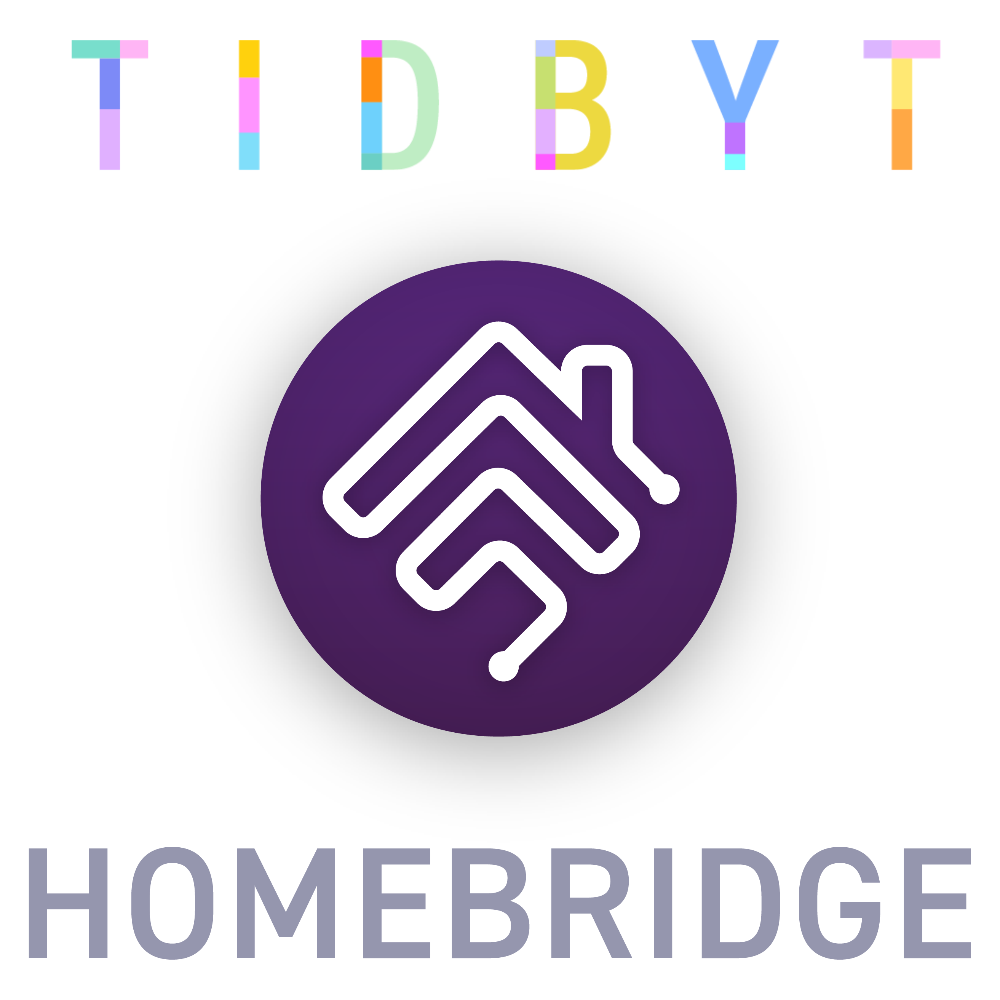
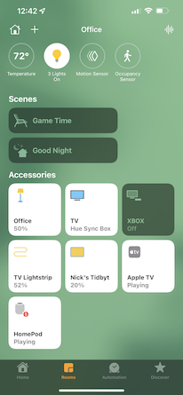
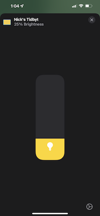
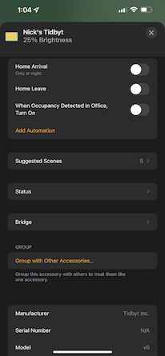
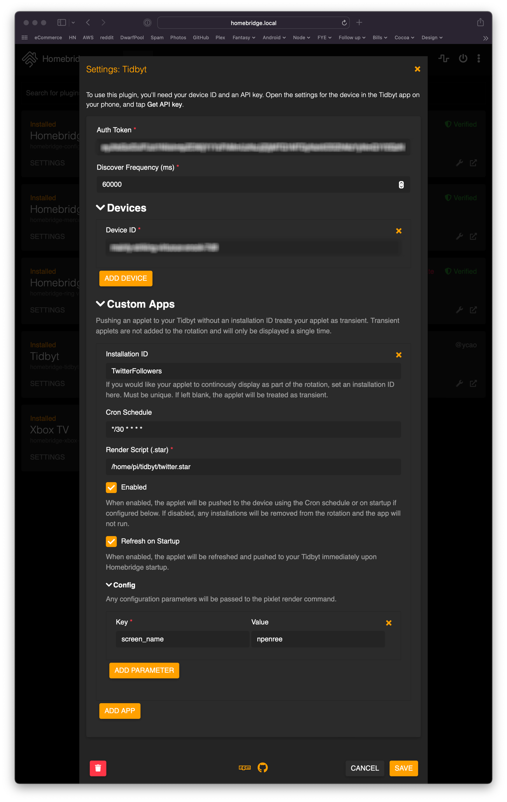
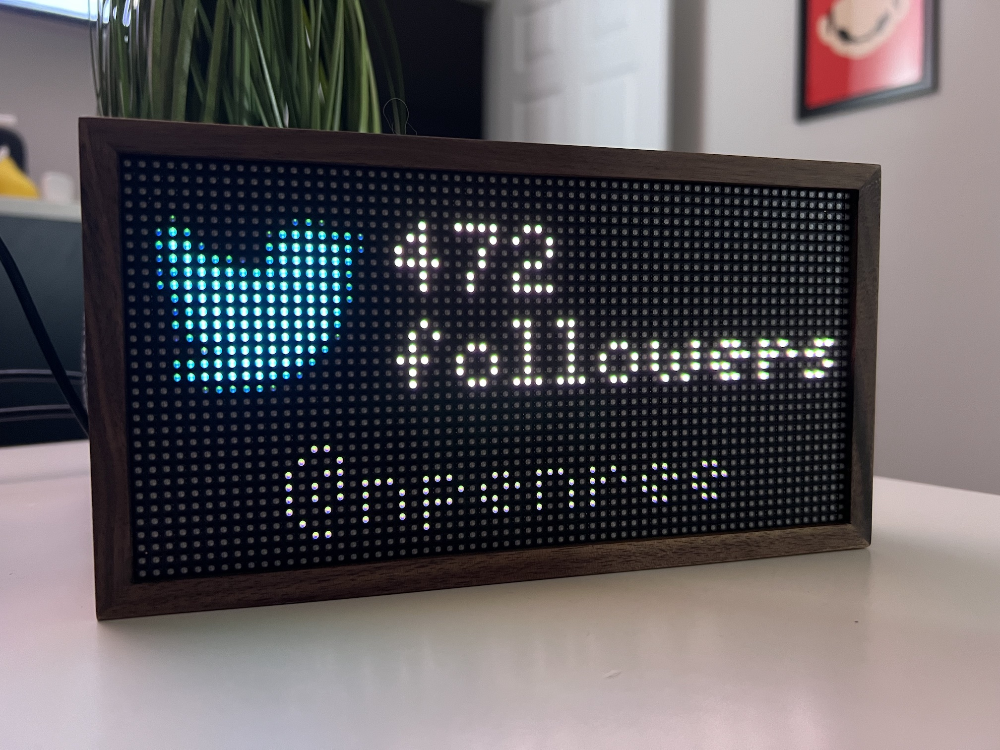

<p align="center">



</p>


# Tidbyt Platform Plugin [](https://github.com/homebridge/homebridge/wiki/Verified-Plugins)

This is a Homebridge plugin that adds HomeKit support to Tidbyt devices.

**This project is not endorsed or sponsored by Tidbyt Inc. and is for educational purposes only.**

## Features

### Brightness Control

So far the integration is fairly limited. The device will show up on your network as a Lightbulb. You can adjust the brightness from 1-100%.

&nbsp;
&nbsp;


> **Note:** Due to Tidbyt API limitations it is not possible to turn the screen completely off at this time. I will add support for turning the device on/off as soon as it is possible to do so.
### Custom Apps

Using Custom Apps, you can configure your very own applets using Pixlet scripts.

You can schedule your applets to update and push to all of your devices at the same time to keep them updated.

Here is what it looks like to configure the [Twitter Followers](https://github.com/drudge/tidbyt-twitter) pixlet that I created last week:



This can also be configured manually in the config.json like this:

```json
{
    ...
    "platforms": [
        ...
        {
            "authToken": "...",
            "discoverFrequency": 60000,
            "managedDevices": [
                {
                    "id": "mainly-awesome-viking-rabbit-2e1"
                }
            ],
            "customApps": [
                {
                    "id": "TwitterFollowers",
                    "enabled": true,
                    "updateOnStartup": true,
                    "script": "/home/pi/tidbyt/twitter.star",
                    "schedule": "*/30 * * * *",
                    "config": [
                        {
                            "key": "screen_name",
                            "value": "npenree"
                        }
                    ]
                }
            ],
            "platform": "Tidbyt"
        }
    ]
}
```
And the final result on the Tidbyt:


## Contributing

This project should be use in conjunction with the [developer documentation](https://developers.homebridge.io/). A full list of all supported service types, and their characteristics is available on this site.

### Setup Development Environment

To develop Homebridge plugins you must have Node.js 12 or later installed, and a modern code editor such as [VS Code](https://code.visualstudio.com/). This plugin template uses [TypeScript](https://www.typescriptlang.org/) to make development easier and comes with pre-configured settings for [VS Code](https://code.visualstudio.com/) and ESLint. If you are using VS Code install these extensions:

* [ESLint](https://marketplace.visualstudio.com/items?itemName=dbaeumer.vscode-eslint)

### Install Development Dependencies

Using a terminal, navigate to the project folder and run this command to install the development dependencies:

```
npm install
```

### Build Plugin

TypeScript needs to be compiled into JavaScript before it can run. The following command will compile the contents of your [`src`](./src) directory and put the resulting code into the `dist` folder.

```
npm run build
```

### Link To Homebridge

Run this command so your global install of Homebridge can discover the plugin in your development environment:

```
npm link
```

You can now start Homebridge, use the `-D` flag so you can see debug log messages in your plugin:

```
homebridge -D
```

### Watch For Changes and Build Automatically

If you want to have your code compile automatically as you make changes, and restart Homebridge automatically between changes you can run:

```
npm run watch
```

This will launch an instance of Homebridge in debug mode which will restart every time you make a change to the source code. It will load the config stored in the default location under `~/.homebridge`. You may need to stop other running instances of Homebridge while using this command to prevent conflicts. You can adjust the Homebridge startup command in the [`nodemon.json`](./nodemon.json) file.

### Versioning

Given a version number `MAJOR`.`MINOR`.`PATCH`, such as `1.4.3`, increment the:

1. **MAJOR** version when you make breaking changes to your plugin,
2. **MINOR** version when you add functionality in a backwards compatible manner, and
3. **PATCH** version when you make backwards compatible bug fixes.

You can use the `npm version` command to help you with this:

```bash
# major update / breaking changes
npm version major

# minor update / new features
npm version update

# patch / bugfixes
npm version patch
```

### Publish Package

When you are ready to publish your plugin to [npm](https://www.npmjs.com/), make sure you have removed the `private` attribute from the [`package.json`](./package.json) file then run:

```
npm publish
```

If you are publishing a scoped plugin, i.e. `@username/homebridge-xxx` you will need to add `--access=public` to command the first time you publish.

#### Publishing Beta Versions

You can publish *beta* versions of your plugin for other users to test before you release it to everyone.

```bash
# create a new pre-release version (eg. 2.1.0-beta.1)
npm version prepatch --preid beta

# publsh to @beta
npm publish --tag=beta
```

Users can then install the  *beta* version by appending `@beta` to the install command, for example:

```
sudo npm install -g homebridge-tidbyt@beta
```


